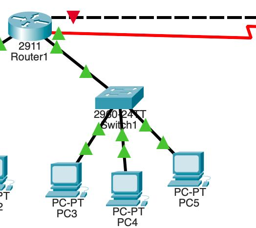

# Question 2: Giving Connections in the LAN

## LAN Connections Overview
The end devices in LAN 1 (Computer Lab) and LAN 2 (Admin Office) are connected to Cisco 2960 switches using Copper Straight-Through cables, and each switch is connected directly to Router 1.

### LAN 1 Connections

### LAN 2 Connections

---

## Cable Details
- *PC to Switch:* Copper Straight-Through Cable.
- *Switch to Router:* Copper Straight-Through Cable.
