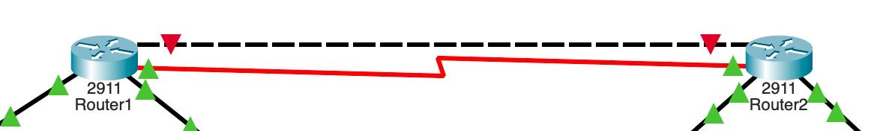
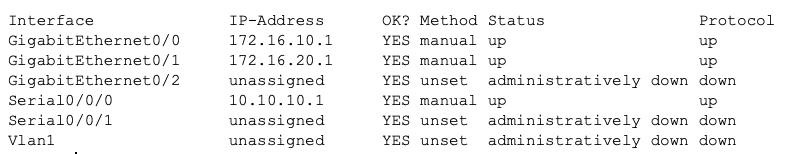
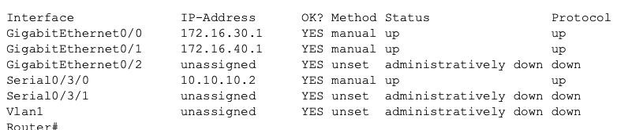
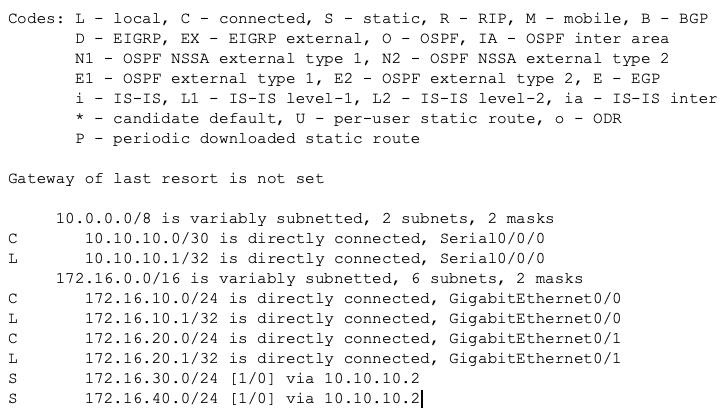
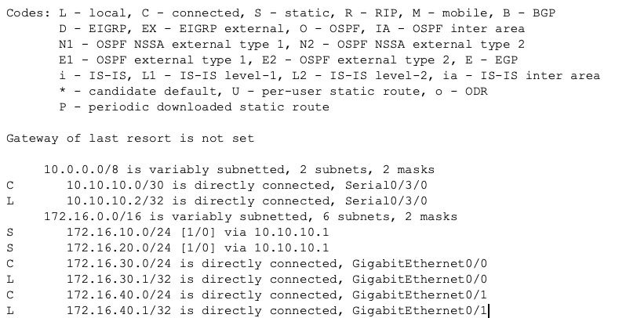

# Q4 – WAN Connection and Static Routing

## 1. WAN Serial Connection

The WAN serial link connects Router 1 and Router 2 and allows communication between the LAN networks on both sides.



Router 1 uses the WAN IP address `10.10.10.1`, while Router 2 uses the WAN IP address `10.10.10.2`.

## 2. Router 1 WAN Configuration

The following screenshot shows the interface configuration of Router 1. The serial interface `Serial0/0/0` is configured with the IP address `10.10.10.1` and is up.



## 3. Router 2 WAN Configuration

The following screenshot shows the interface configuration of Router 2. The serial interface `Serial0/3/0` is configured with the IP address `10.10.10.2` and is up.



## 4. Static Routing

Static routes were configured on both routers so that all LAN networks can communicate through the WAN connection.

### Router 1



Router 1 uses the following static routes to reach the networks behind Router 2:

```text
ip route 172.16.30.0 255.255.255.0 10.10.10.2
ip route 172.16.40.0 255.255.255.0 10.10.10.2
```

### Router 2



Router 2 uses the following static routes to reach the networks behind Router 1:

```text
ip route 172.16.10.0 255.255.255.0 10.10.10.1
ip route 172.16.20.0 255.255.255.0 10.10.10.1
```

## 5. Commands Used

### Router 1 WAN Configuration

```text
enable
configure terminal
interface Serial0/0/0
ip address 10.10.10.1 255.255.255.252
no shutdown
exit
ip route 172.16.30.0 255.255.255.0 10.10.10.2
ip route 172.16.40.0 255.255.255.0 10.10.10.2
```

### Router 2 WAN Configuration

```text
enable
configure terminal
interface Serial0/3/0
ip address 10.10.10.2 255.255.255.252
no shutdown
exit
ip route 172.16.10.0 255.255.255.0 10.10.10.1
ip route 172.16.20.0 255.255.255.0 10.10.10.1
```

## Reflection

In this phase, I learned how to configure a WAN serial connection between two routers and how to configure static routes. I also learned how routing allows different LAN networks to communicate with each other and how to verify and document the network configuration using screenshots.
